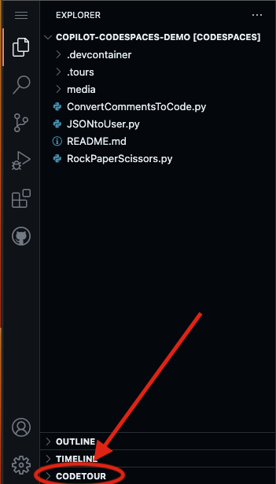
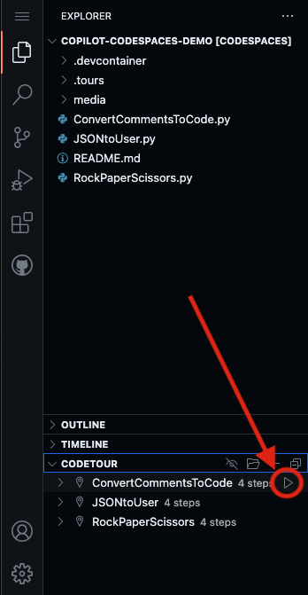

# Welcome to the Copilot+Codespaces Playground Demo 

## Our Mission
Our goal is to provide a self-serve, one-click Copilot experience that will be hosted on Codespaces.

## What to Expect
During the the GitHub Copilot+Codespaces Playground Demo, you are in charge! You will have the opportunity to learn more about Copilot, it's features and how it can help you achieve your development Goals!

<em>If you are in need of assistance, we have provided Codetours located in the left hand corner that help guide you through the current Copilot capabilities!</em>

## Getting Started
1. To get started, start by selecting 'Use this template', and 'Open in a codespace'

2. Once the codespace has loaded, select 'Codetour' on the lower left corner, and start the JSONtoUser tour!

3. Next, select the play button for one of the tours listed. Enjoy!

## FAQ

What is GitHub Copilot?
 
   
GitHub Copilot is an AI pair programmer that helps you write code faster and with less work. It draws context from comments and code to suggest individual lines and whole functions instantly. GitHub Copilot is powered by Codex, a generative pretrained language model created by OpenAI. It is available as an extension for Visual Studio Code, Visual Studio, Neovim, and the JetBrains suite of integrated development environments (IDEs). Visit here for more information about [GitHub Copilot](https://github.com/features/copilot)

What is GitHub Codespaces?
 
   
A codespace is a development environment that's hosted in the cloud. You can customize your project for GitHub Codespaces by configuring dev container files to your repository (often known as Configuration-as-Code), which creates a repeatable codespace configuration for all users of your project. 

GitHub Codespaces run on a variety of VM-based compute options hosted by GitHub.com, which you can configure from 2 core machines up to 32 core machines. You can connect to your codespaces from the browser or locally using an IDE like Visual Studio Code or IntelliJ. Visit here for more information about [GitHub Codespaces](https://github.com/features/codespaces)

Are there any prerequisites to get access to the Copilot+Codespaces Playground Demo?
 
   
A GitHub account is the only requirement to use the GitHub Copilot + Github Codespaces playground demo environment. The demo will only be available to the extent of your account’s Codespaces entitlements; if you want to keep utilizing the environment after your limit has been met, you will need to purchase additional entitlements Visit here to signup for a [GitHub Copilot](https://github.com/features/copilot) trial for the full experience! 

What are the feature limitations of the Copilot+Codespaces Playground Demo?
 

This demo will only showcase current GitHub Copilot capabilities that are intended to help programmers, such as autocompletion suggestions, functions, and the ability to convert code comments into actual lines of code. Any features mentioned for GitHub Copilot X will not be offered in this demo experience. Visit here to signup for the [GitHub Copilot X Waitlists](https://github.com/features/preview).
   

🛠 Copilot+Codespaces Playground Demo Disclaimer 🛠
 
   
Please note that during the GitHub Copilot+Codespaces Playground Demo, the suggestions generated by GitHub Copilot via Codespaces will differ and may not always be the same. This is due to GitHub Copilot being an artificially intelligent tool that generates code suggestions based on the input it receives. Visit here for more information about [GitHub Codespaces](https://github.com/features/codespaces) and [GitHub Copilot](https://github.com/features/copilot)! 

